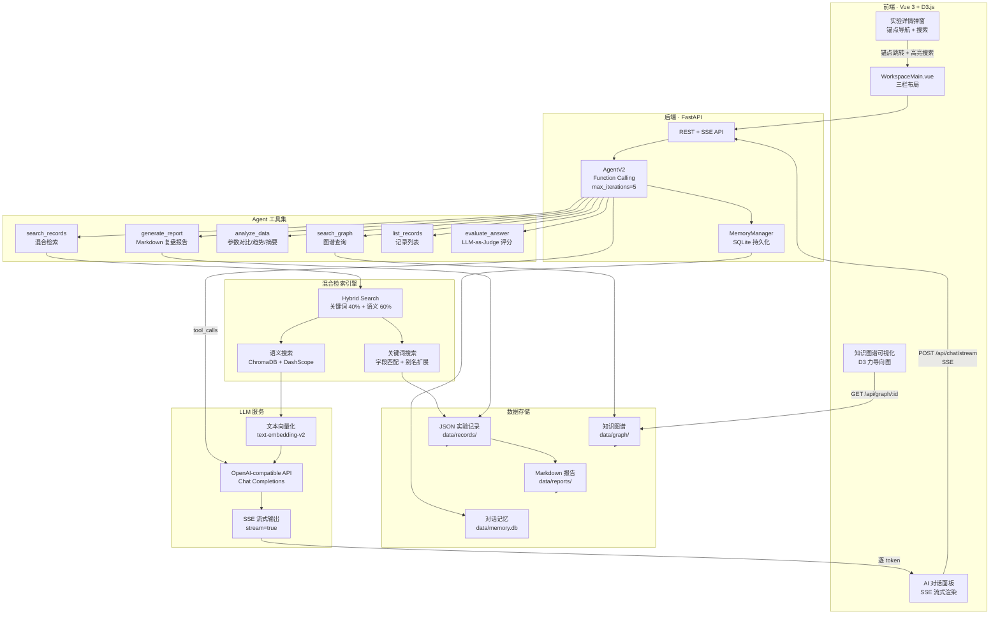
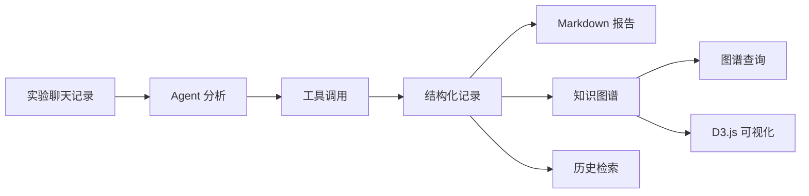

# 基于 Agent 与实验知识图谱的实验记录整理与调参复盘助手

一个面向计算机视觉实验场景的本地化实验记录整理工具。项目通过 Streamlit 提供交互页面，读取实验聊天记录或日志文本，由轻量 Agent 自动选择工具，提取命令、参数、报错、解决方案和实验结论，并进一步生成结构化 JSON、Markdown 复盘报告和轻量级实验知识图谱。

项目解决的问题很具体：实验过程中，训练命令、参数配置、报错信息、调参过程和最终解决方案经常散落在 GPT 聊天记录、终端日志、临时笔记中。时间一长，很难复盘“当时用了什么参数、为什么报错、最后怎么解决、下一步打算试什么”。本项目希望把这些零散信息沉淀成可检索、可复盘、可扩展的实验记忆。

当前版本是 MVP，重点打通本地闭环，不使用 Neo4j，不使用向量数据库，也不包含自动训练模型能力。

## 项目亮点

- 轻量 Agent 工具调度：根据文本内容选择命令提取、参数提取、报错分析、解决方案提取等工具。
- 参数变化过程追踪：区分 `original`、`adjusted`、`suggested` 三类参数，避免原始配置和调参结果混在一起。
- 实验知识图谱构建：将结构化实验记录转换为实体和关系，用于沉淀报错、解决方案和调参经验。
- JSON / Markdown 双格式沉淀：机器可读的 JSON 记录和人类可读的实验复盘报告同时保存。
- 历史检索和图谱查询：支持对历史实验记录和本地图谱 JSON 做关键词查询。

## 功能列表

- 上传实验聊天记录：支持 `txt`、`md`、`json`。
- Agent 自动选择工具：根据关键词判断需要调用哪些工具。
- 命令提取：识别 `python train.py`、`bash`、`CUDA_VISIBLE_DEVICES` 等运行命令。
- 参数抽取：从运行命令、解决方案和下一步计划中抽取参数。
- 参数分层：输出 `params.original`、`params.adjusted`、`params.suggested`。
- 报错分析：识别 traceback、CUDA OOM、ModuleNotFoundError、FileNotFoundError 等信息。
- 解决方案提取：提取“降低 batch”“修改 lr”“安装依赖”等排查和修复记录。
- LLM 增强抽取：预留 OpenAI-compatible Chat Completions API，未配置时自动回退到规则抽取。
- JSON 实验记录保存：保存到 `data/records/`。
- Markdown 实验复盘报告：保存到 `data/reports/`。
- 历史关键词检索：从历史 JSON 记录中检索 task、dataset、model、commands、params、errors、solutions 等字段。
- 实验知识图谱：生成实体、关系并保存为 graph JSON。
- 图谱关键词查询：从 `data/graph/` 下的图谱 JSON 中检索实体和关系。
- 可选 pyvis 可视化：安装 `networkx` 和 `pyvis` 后可生成 HTML 图谱。

## 系统架构



## 系统工作流



## Agent 工具设计

- `command_tool`：提取运行命令，例如训练、测试、推理命令。
- `params_tool`：提取参数，并区分原始参数、调整后参数和建议尝试参数。
- `error_tool`：提取报错信息和错误类型，例如 CUDA OOM、依赖缺失、文件路径错误。
- `solution_tool`：提取解决方案，并识别解决方案中涉及的参数调整。
- `report_tool`：根据结构化记录生成 Markdown 实验复盘报告。
- `search_tool`：对历史 JSON 实验记录做关键词检索。

Agent 的核心逻辑位于 `src/agent.py`。第一版没有使用复杂 Agent 框架，而是用清晰的函数模拟“判断内容 -> 选择工具 -> 调用工具 -> 合并结果”的过程。

## 知识图谱设计

知识图谱模块位于 `src/graph/`，第一版使用本地 JSON 存储。

实体类型：

- `Experiment`：实验
- `Dataset`：数据集
- `Model`：模型
- `Command`：运行命令
- `Parameter`：参数
- `Error`：报错
- `Solution`：解决方案
- `Conclusion`：实验结论
- `NextStep`：下一步建议

关系类型：

- `USES_DATASET`：实验使用数据集
- `USES_MODEL`：实验使用模型
- `RUNS_COMMAND`：实验运行命令
- `HAS_ORIGINAL_PARAMETER`：实验包含原始参数
- `HAS_ADJUSTED_PARAMETER`：实验包含调整后参数
- `HAS_SUGGESTED_PARAMETER`：实验包含建议尝试参数
- `HAS_ERROR`：实验出现报错
- `SOLVED_BY`：报错通过某方案解决
- `ADJUSTS_PARAMETER`：解决方案调整了某个参数
- `PRODUCES_CONCLUSION`：实验产生结论
- `SUGGESTS_NEXT_STEP`：实验建议下一步

图谱数据流：

```text
实验聊天记录 -> Agent 抽取 -> 结构化记录 -> 图谱构建 -> 图谱保存 -> 图谱查询 / 可视化
```

## 参数分层设计

为了避免“原始命令参数”和“报错后修改的参数”混在一起，项目将参数分为三层：

- `params.original`：从原始运行命令中提取的参数。例如第一次运行时的 `batch=16`。
- `params.adjusted`：从解决方案或排查记录中提取的调整后参数。例如 OOM 后将 `batch` 改为 `8`。
- `params.suggested`：从下一步计划中提取的建议尝试参数。例如后续尝试 `yolov8s.pt`、`batch=4`、`lr0=0.005`。

示例结构：

```json
{
  "params": {
    "original": {
      "batch": "16",
      "lr0": "0.01"
    },
    "adjusted": {
      "batch": "8"
    },
    "suggested": {
      "model": "yolov8s.pt",
      "batch": "4",
      "lr0": "0.005"
    }
  }
}
```

## 项目目录结构

```text
experiment-agent/
|-- app.py
|-- requirements.txt
|-- README.md
|-- .env.example
|-- AGENTS.md
|-- docs/
|   `-- llm_config.md
|-- data/
|   |-- raw/
|   |-- records/
|   |-- reports/
|   `-- graph/
|-- examples/
|   `-- sample_chat.txt
|-- prompts/
|   |-- extract_prompt.txt
|   `-- summary_prompt.txt
`-- src/
    |-- agent.py
    |-- llm_client.py
    |-- reader.py
    |-- parser.py
    |-- storage.py
    |-- tools/
    |   |-- command_tool.py
    |   |-- params_tool.py
    |   |-- error_tool.py
    |   |-- solution_tool.py
    |   |-- report_tool.py
    |   `-- search_tool.py
    `-- graph/
        |-- schema.py
        |-- builder.py
        |-- store.py
        |-- query.py
        `-- visualize.py
```

## 快速开始（推荐方式：FastAPI + Vue3）

```bash
# 1. 安装依赖
pip install -r requirements.txt
cd frontend && npm install && cd ..

# 2. 配置 LLM（可选，不配也能用规则抽取）
cp .env.example .env
# 编辑 .env，填入 LLM_API_KEY / DASHSCOPE_API_KEY

# 3. 启动后端（端口 8000）
python -m uvicorn backend.main:app --reload --port 8000

# 4. 启动前端（端口 5173）
cd frontend && npm run dev

# 5. 浏览器打开 http://localhost:5173
```

> 也支持旧的 Streamlit 单文件模式：`streamlit run app.py`

## LLM 配置说明

项目支持 OpenAI-compatible Chat Completions API。复制 `.env.example` 为 `.env`，并填写：

```bash
LLM_API_KEY=your-api-key
LLM_BASE_URL=https://your-openai-compatible-endpoint/v1
LLM_MODEL=your-model-name
```

详细配置、启用判断、常见错误和回退方式见：

[docs/llm_config.md](docs/llm_config.md)

如果不配置 LLM API，项目不会报错，会使用规则抽取结果，并在页面中显示 `metadata.llm_used = False`。

## 示例输出

使用 `examples/sample_chat.txt` 做模拟分析时，当前样例可生成：

```text
实体数量：19
关系数量：20
包含 Error -> Solution：是
包含 Solution -> Parameter 的 ADJUSTS_PARAMETER：是
```

示例输出文件：

```text
data/records/20260513-145750-yolov8-在自定义缺陷检测数据集上做一次训练.json
data/reports/20260513-145750-yolov8-在自定义缺陷检测数据集上做一次训练.md
data/graph/graph-20260513-145750-287616.json
```

图谱关键词搜索示例：

```text
batch
CUDA
SOLVED_BY
```

如果当前环境尚未安装 `pyvis`，点击图谱可视化时会返回友好提示，不影响主流程。

## 安全提示

- `.env` 已在 `.gitignore` 中，**请勿**将 API Key 硬编码到代码或提交到 Git
- 公开仓库请使用 `.env.example` 引导他人配置

## 截图区域

TODO:

- `screenshots/upload.png`
- `screenshots/agent_trace.png`
- `screenshots/structured_json.png`
- `screenshots/report.png`
- `screenshots/graph_entities.png`
- `screenshots/graph_visualization.png`

## 当前限制

- 图谱查询仍以关键词匹配为主，暂未接入语义检索。
- LLM 端到端效果取决于用户配置的模型和提示词稳定性。
- 暂未使用 Neo4j，图谱以本地 JSON 存储。
- 暂不支持自动训练模型或自动修改训练代码。
- 复杂关系推断仍以简单规则为主。

## 后续优化方向

- 语义检索：对实验记录和图谱节点做 embedding 检索。
- 实验时间线：按时间组织实验过程、参数变化和结论。
- 报错知识库：沉淀常见错误、可能原因和解决方案。
- 图谱推理：基于历史实验经验推断可能的修复路径。
- 多文件批量分析：一次整理多个日志、聊天记录或配置文件。
